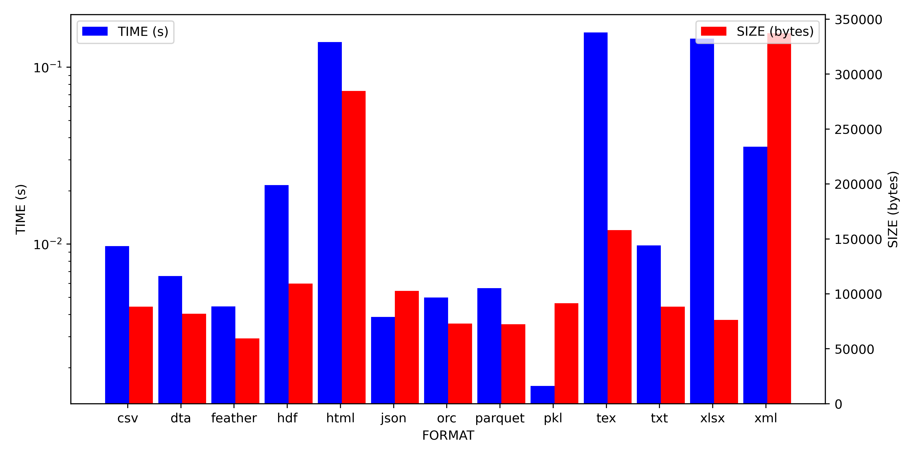

# Trading Simulator and Analyzer

## What this does?
Downloads historical data of a _stock symbol_ for _past x years_ using [jugaad-data](https://github.com/jugaad-py/jugaad-data) API and benchmarks the time and space taken to store the data in various formats.
A graph is stored in the file _SYMBOL.png_. Benchmark results are outputted to console.

## How to use?
### To use
* Clone this repository.
* Run `make SYMBOL=<symbol> num_years=<num_years>`. Default values of BPCL and 5 are taken if none are provided.

### To clean
* Run `make clean`

## Known issues
* pip virtual environment might not get properly installed. 
    Only a temporary workaround is provided for debian based systems.(On which the gradescope servers run)

## Example

## Further plans
* As per the assignment, UI for the following features
    * Plot graph in defined time scale.
    * Plot multiple stocks in same time scale.
    * Apply technical filters.
* Add navigation among pages.